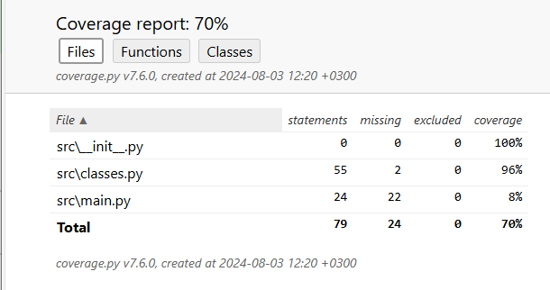

# Введение в ООП
### На данном этапе созданы классы, класс-методы, инициализация, добавлены приватные атрибуты,  написаны тесты
### Использование:
1. Откройте проект.
2. Запустите файл main.py. в модуле src
### Покрытие тестами
